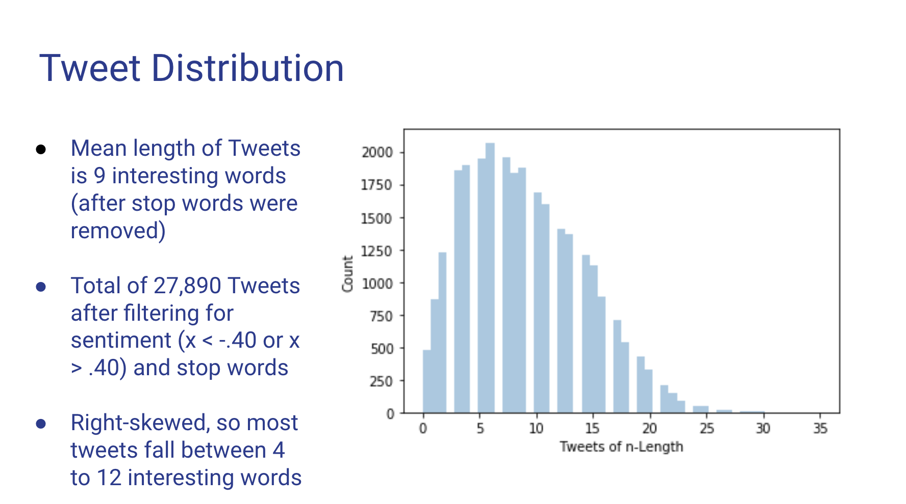
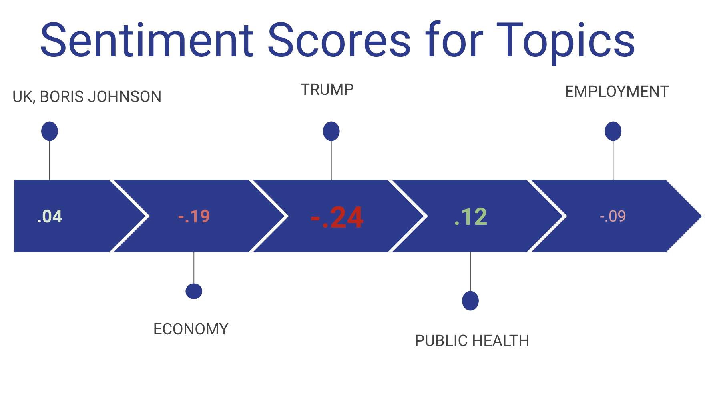

# COVID-19 Twitter Topic Modelling
by Brayton Hall

Full Presentation [in Repository.](https://github.com/bphall/tweet_nlp/blob/master/tweet_covid.pdf)

Table of Contents:

- [Data](#data)
- [EDA](#eda)
- [LDA Model](#model)
- [Results](#results)

## Introduction
This project was conducted in early April, 2020, during the rise of the COVID-19 global pandemic. The aim was to collect tweets over the course of a few days, and use an LDA (Latent Dirichlet Allocation) model to find distinct, coherent 'topics' which those tweets belonged to. For example, expected topics included tweets relating to 'Trump', 'Economy', 'Healthcare', etc. Topic modelling in this way can confirm our intuitions about the variety, and volume, of dialogue happening in real time in social media space. LDA modelling allows for a single document (or tweet, in this case) to belong to multiple topics, such as both 'Trump' and 'Economy', if a tweet included Donald Trump addressing an economic topic. Five distinct and human-coherent topics were found: 'Trump', 'Economy', 'Public Health', 'Employment', and 'UK/Boris Johnson.' Each topic was then analyzed for sentiment to show the overall social media 'mood' concerning that topic (positive, negative, neutral). 
 

## Data Collection and Cleaning 
The python library 'twint' was used to collect 100,000 tweets related to 'coronavirus'. The tweets were filtered by removing tweets shorter than 9 words, since those tweets were considered too short to be useful, and presumably included images, videos, or other media outside the scope of NLP. The tweets were then lower-cased, punctuation-removed with regex, tokenized, and analyzed for sentiment using Vader sentiment analyzer, a pre-trained model for capturing social-media specific sentiment. The tweets were further filtered by removing tweets with neutral sentiment, since many neutral tweets were journalistic in nature, and didn't contribute to naturally-occuring topics from independent Twitter users.

## EDA 
The following shows general information about the tweets collected.
### 

## LDA Model 
LDA, or Latent Dirichlet Allocation, creates a 'generative probabilistic model' which is similar to K-means clustering, but allows for multiple memberships, or 'fuzzy' memberships. So a tweet involving 'Trump' and 'Economy' will, based on other words in the tweet, have a maximum probability corresponding to one of them. In this case, *five* distinct topics were chosen because, despite more potential topics (and some higher 'coherence' scores), five topics created the most human-intelligible categories of tweets. Custom stop words were added to the base NLTK stop word set, and accreted continuously after multiple iterations of the model when it became clear that certain high-volume words were not contributing to distinct topics, words such as 'virus', 'corona', and 'covid'.

## Results 
### 

 

